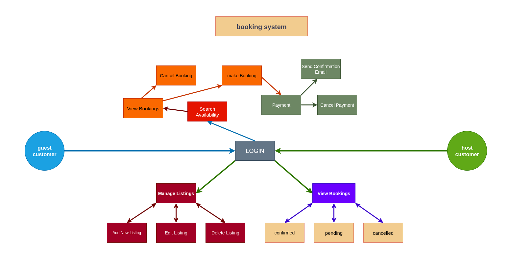

# Requirement Analysis in Software Development

This repository is dedicated to exploring the requirement analysis phase of software development. It serves as a foundation for documenting, analyzing, and structuring project requirements, particularly focused on a booking management system. The goal is to provide a clear and organized approach to gathering and specifying requirements to ensure successful software development outcomes.

## What is Requirement Analysis?

Requirement Analysis is a critical phase in the Software Development Lifecycle (SDLC) that involves gathering, understanding, and documenting the needs and expectations of stakeholders for a software system. It serves as the foundation upon which the entire development process is built.

During requirement analysis, developers, business analysts, and stakeholders collaborate to identify both functional requirements (what the system should do) and non-functional requirements (how the system should perform, such as usability, reliability, and performance). This process ensures that the software solution aligns with business goals and user needs.

**Importance in SDLC:**

- **Foundation for Development:** Accurate requirements provide a clear blueprint for design, development, and testing, reducing the risk of project failure.
- **Improved Communication:** Facilitates a shared understanding between clients, developers, and other stakeholders, minimizing misunderstandings.
- **Cost and Time Efficiency:** Early identification of requirements helps avoid costly changes and rework during later stages of development.
- **Quality Assurance:** Well-defined requirements enable better validation and verification of the software, ensuring it meets the intended purpose.
- **Risk Mitigation:** Helps in identifying potential risks and constraints upfront, allowing teams to plan accordingly.

In summary, requirement analysis bridges the gap between user expectations and technical implementation, playing a vital role in delivering successful software projects.

## Why is Requirement Analysis Important?

1. **Ensures Clear Understanding of Project Goals**  
   Requirement analysis helps all stakeholders develop a shared understanding of the project’s objectives, ensuring that the software delivers the expected value and functionality.

2. **Reduces Development Costs and Time**  
   By identifying requirements early and clearly, teams can prevent costly mistakes, minimize rework, and streamline the development process, leading to faster project completion and reduced budget overruns.

3. **Improves Product Quality and User Satisfaction**  
   Thorough requirement analysis leads to software that meets user needs and business goals more effectively, enhancing usability, reliability, and overall satisfaction.

## Key Activities in Requirement Analysis

- **Requirement Gathering**  
  This is the initial stage where information is collected from various stakeholders including clients, users, and subject matter experts. Techniques like interviews, questionnaires, and workshops are used to gather raw data about what the system should achieve.

- **Requirement Elicitation**  
  Beyond just collecting information, elicitation involves actively engaging stakeholders to uncover hidden or implicit requirements. It requires asking the right questions and facilitating discussions to clarify needs and expectations.

- **Requirement Documentation**  
  Once requirements are gathered and elicited, they must be clearly documented in a structured and organized manner. This includes creating requirement specifications, user stories, or use case documents that serve as reference points for the project.

- **Requirement Analysis and Modeling**  
  In this phase, the documented requirements are analyzed for feasibility, consistency, and completeness. Modeling techniques such as flowcharts, data models, and use case diagrams are used to visualize and better understand the requirements.

- **Requirement Validation**  
  The final activity ensures that the documented requirements accurately reflect stakeholder needs and are achievable within project constraints. Validation often involves reviews, inspections, and prototyping to confirm correctness and completeness.

## Types of Requirements

### Functional Requirements

Functional requirements define what the system should do—the specific behaviors or functions the software must perform to meet user needs.

For the booking management system, examples include:

- **Hotel Management:** Allow hotel managers to add, update, and delete hotel information through a dedicated portal.
- **Search Service:** Enable customers to search for hotels based on location, availability, price, and ratings.
- **Booking Service:** Facilitate booking of rooms by customers, including availability checking and reservation confirmation.
- **Payment Integration:** Support secure payment processing via third-party services.
- **View Booking:** Allow both customers and managers to view current and past booking details.
- **Notification Service:** Send notifications to customers and managers about booking confirmations, cancellations, and special offers.

### Non-functional Requirements

Non-functional requirements describe how the system performs its functions—attributes like performance, scalability, reliability, and usability.

Examples for the booking management system include:

- **Performance:** The search service must return results within 2 seconds, even during peak traffic.
- **Scalability:** The system should handle high volumes of user traffic using micro-service architecture and load balancers.
- **Reliability:** Use master-slave database replication and caching (Redis) to ensure data consistency and availability.
- **Security:** Secure all payment transactions and protect user data privacy.
- **Maintainability:** Modular design with separate services (hotel management, booking, view booking) to ease maintenance and updates.
- **Usability:** Provide intuitive and responsive user portals for customers and hotel managers.
- **Data Consistency:** Synchronize data across databases using messaging queues and consumers to keep information up to date.

## Use Case Diagrams

### What are Use Case Diagrams?

Use Case Diagrams are visual models from the Unified Modeling Language (UML) that illustrate how different users (actors) interact with a system. They capture the system’s functional requirements by showing the various ways users engage with the system to achieve specific goals or tasks (use cases). This helps provide a clear overview of the system’s behavior from the user’s perspective.

### Benefits of Use Case Diagrams

- **Clarify Requirements:** Help stakeholders understand the system’s functionalities and user interactions.
- **Improve Communication:** Serve as a visual tool to align developers, clients, and team members on system features.
- **Guide Development:** Identify key user interactions to inform system design and implementation.
- **Identify Actors and Use Cases:** Ensure all user roles and necessary functions are captured.
- **Support Testing:** Provide a basis for creating test cases to validate system functionality.

### Actors and Use Cases

#### Guest Customer

A guest customer interacts with the booking system to find and book services. Their key use cases include:

- Register / Login
- Search Availability
- Make Booking
- Cancel Booking
- View Bookings
- Make Payment
- Cancel Payment
- Receive Confirmation Email

#### Host Customer

A host customer manages listings and tracks bookings for their offerings. Their key use cases include:

- Register / Login
- Manage Listings
  - Add New Listing
  - Edit Listing
  - Delete Listing
- View Bookings
  - Confirmed
  - Pending
  - Cancelled

### Use Case Diagram

Below is the use case diagram illustrating the actors and their interactions with the booking management system:

## Acceptance Criteria

### Importance of Acceptance Criteria in Requirement Analysis

Acceptance Criteria are specific conditions or requirements that a software product must satisfy to be accepted by stakeholders, including clients and end-users. They serve as clear, measurable guidelines that define when a feature or user story is complete and functioning as intended.

In Requirement Analysis, Acceptance Criteria are crucial because they:

- Ensure a common understanding between developers, testers, and stakeholders about what needs to be delivered.
- Provide a basis for writing test cases and validating features.
- Help prevent scope creep by clearly defining feature boundaries.
- Facilitate communication and alignment throughout the development lifecycle.
- Improve the quality and reliability of the final product by setting objective success measures.

### Example: Acceptance Criteria for Checkout Feature

**Feature:** Checkout process in the booking management system

**Acceptance Criteria:**

1. The user must be able to review booking details (dates, property, price) before confirming payment.
2. The system must validate payment information (credit card details, expiration date, CVV).
3. The payment process should support major payment methods (credit/debit cards, PayPal).
4. Upon successful payment, a confirmation message with booking reference is displayed.
5. If payment fails, the user receives a clear error message and the option to retry.
6. The system sends a confirmation email with booking details immediately after successful checkout.
7. The booking status is updated to "Confirmed" only after successful payment.

---

Adding acceptance criteria like these helps ensure that the checkout feature meets both business requirements and user expectations.
